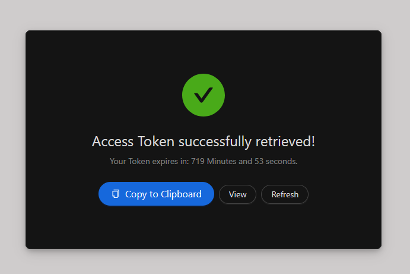

# Token Website

This is an application designed to retrieve and display access tokens from an OIDC provider such as Keycloak.


## Usage
The user can log in via IdP (e.g. via Keycloak) and retrieve access tokens for interacting with the N5GEH platform. These tokens are necessary if the APIs are protected as described in [n5geh.tutorials.api-protection](https://github.com/N5GEH/n5geh.tutorials.api-protection).

This is an easy way to obtain a token for development purposes. The user interface looks like this:



## Deployment

**Deployment via Docker:**

- Build the image using the provided `Dockerfile`. Images are available at [ghcr.io/gewv-tu-dresden/n5geh.token_ui](https://github.com/gewv-tu-dresden/n5geh.apiTokenWebsite/pkgs/container/n5geh.token_ui).
- Utilize Docker Compose with the provided [compose.yml](compose.yml) file and configure the following environment variables:

    ```yaml
    CLIENT_ID = # ID of OAuth2 Client
    CLIENT_SECRET = # Secret of OAuth2 Client
    SECRET = # Secret for express-openid-connect (https://github.com/auth0/express-openid-connect) - LONG_RANDOM_VALUE
    ISSUER_BASE_URL = # Base URL of the Authorization Server
    HOST = # Hostname of the UI in the format: https://${HOST}/
    ```

- The UI is accessible at port 4000.

## License

The Token Website is licensed under the BSD 3-Clause License [](LICENSE).
